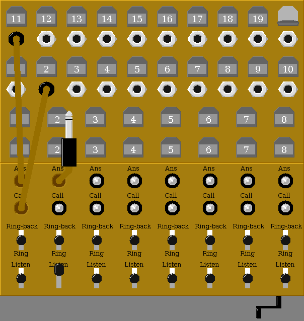
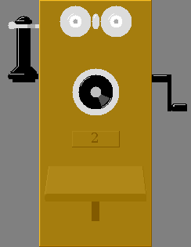

# Telephone Switchboard Simulator

This project is an attempt to create a simulation of
what it was like, circa 1915, to make phone calls.
It is modeled after a Kellogg Magneto Switchboard, circa 1915,
and Stromberg-Carlson Magneto Telephones, of similar vintage.

Inspired by [Kellogg Magneto Switchboards Bulletin No. 10](docs/KG_1915C_BLTN_10_WM_MAGNETO_SB.pdf)
courtesy Mike Neale.

An example session is presented [Here](https://htmlpreview.github.io/?https://github.com/durgadas311/telephone/master/sim/www/example.html).

### Help files

- [Using the Simulator](https://htmlpreview.github.io/?https://github.com/durgadas311/telephone/master/sim/docs/switchboard_sim.html)
- [Operator Manual](https://htmlpreview.github.io/?https://github.com/durgadas311/telephone/master/sim/docs/operator.html)
- [Subscriber Manual](https://htmlpreview.github.io/?https://github.com/durgadas311/telephone/master/sim/docs/subscriber.html)

### Downloads and Running

The two JAR files switchboard.jar and telephone.jar provide their respective
parts of the simulation.
In the subdirectory "java11" there are versions of the JARs built for older
JAVA runtimes. These would be useful if your current runtime complains about
the JAR/class versions.

Running each typically involves the command:

    java -jar switchboard.jar

or

    java -jar telephone.jar

Configuration may be done using the "System->Setup" menu, which alters the
properties files.
A minimal run includes one switchboard and one or more
telephones.

These simulations connect to each other using TCP/IP networking.
By default, they all run on the same machine and don't require
an actual LAN/WAN. They may be configured to use network addresses
and connect between different computers, possibly separated
across the internet.
